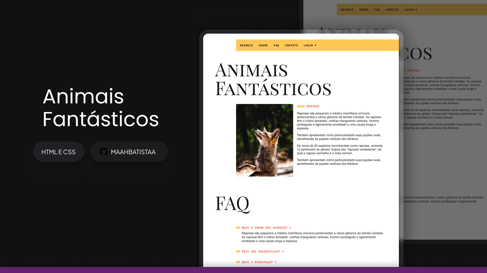

## [Animais Fantásticos](./animais-fantasticos)

### Stack utilizada
***Front-end:*** HTML, CSS e JavaScript

## [Wildbeast](./wildbeast)

### Stack utilizada
***Front-end:*** HTML e CSS

## [FlexBlog](./flexblog)

### Stack utilizada
***Front-end:*** HTML e CSS

## [Bikcraft](./bikcraft)

### Stack utilizada
***Front-end:*** HTML e CSS

