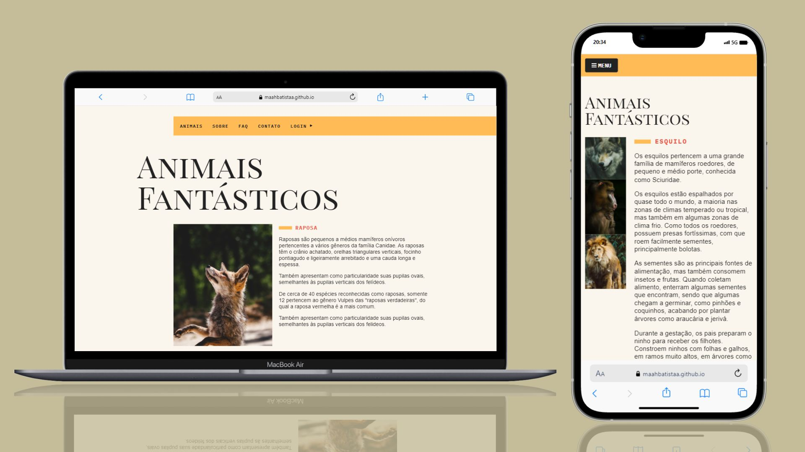
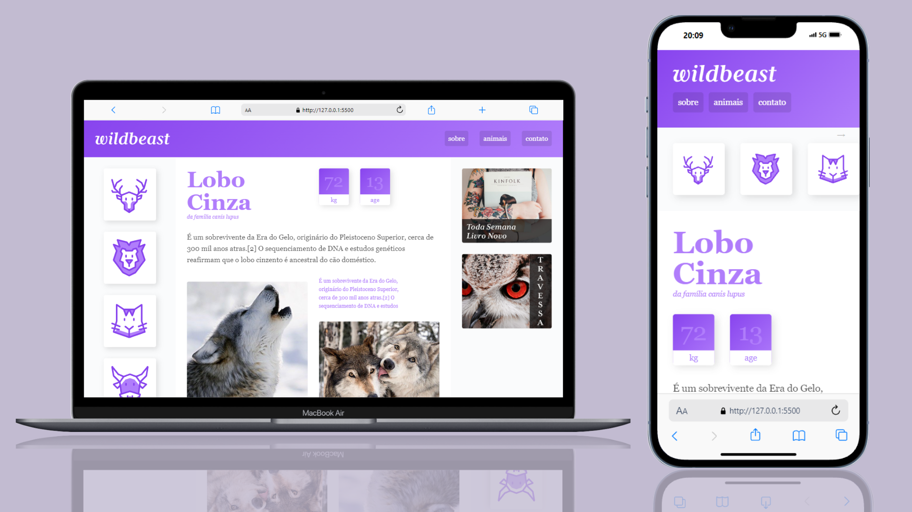
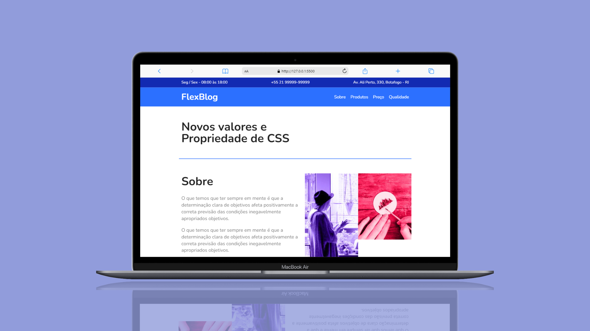
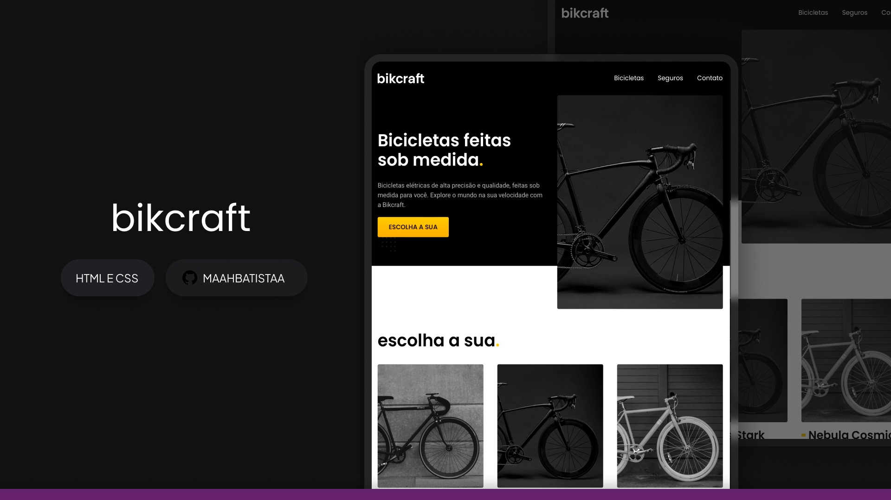

## Animais Fantásticos

### Stack utilizada
***Front-end:*** HTML, CSS e JavaScript

## Wildbeast

### Stack utilizada
***Front-end:*** HTML e CSS

## FlexBlog

### Stack utilizada
***Front-end:*** HTML e CSS

## Bikcraft

### Stack utilizada
***Front-end:*** HTML e CSS

